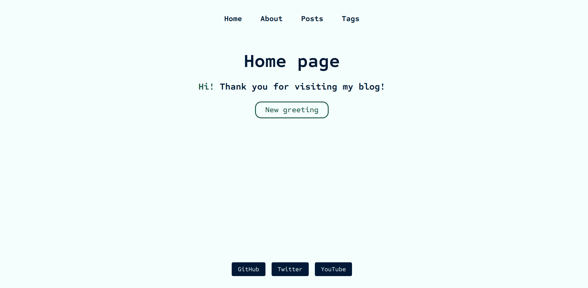
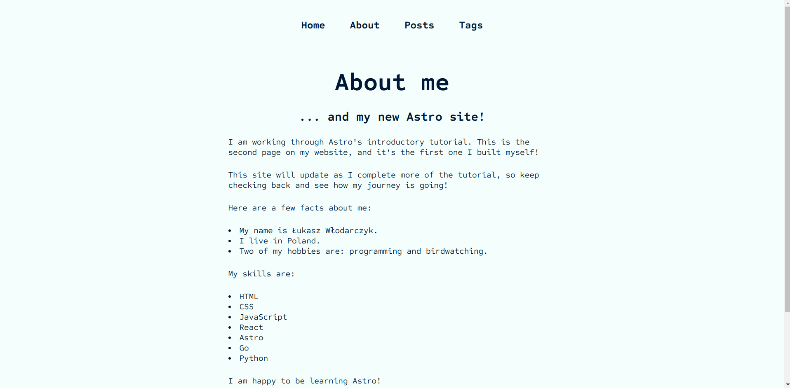
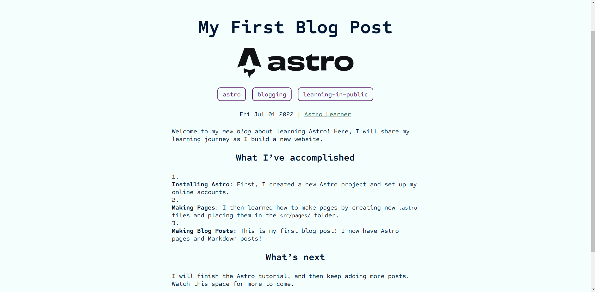
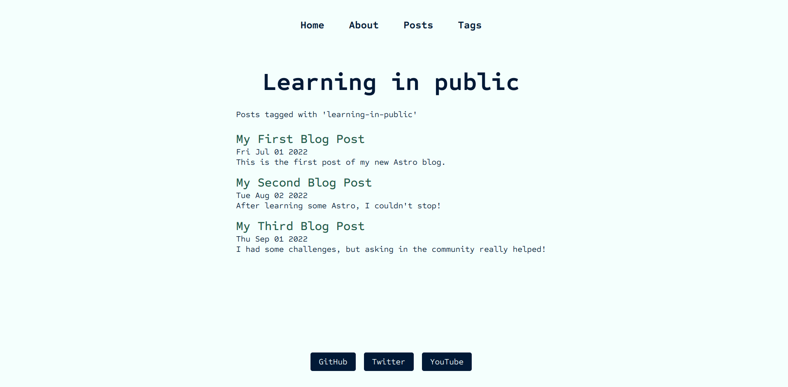

# Astro Blog 🚀

## Introduction

This is the example blog built with Astro web framework inspired by [the official tutorial](https://docs.astro.build/en/tutorial/0-introduction/).

## Contributing

If you would like to contribute to the project, feel free to fork the repository and submit a pull request.

## License

This project is licensed under the [MIT License](https://opensource.org/license/mit/) - see the [LICENSE](LICENSE) file for details.
